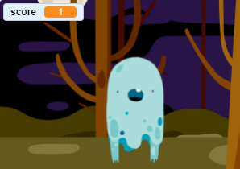

## மதிப்பெண் சேர்க்கவும்

இப்போது நீங்கள் மதிப்பெண்ணை வைத்து உங்கள் விளையாட்டை மிகவும் சுவாரஸ்யமாக்கப் போகிறீர்கள்!

\--- task \---

`Score`{:class="block3variables"}(மதிப்பெண்) எனப்படும் ஒரு புதிய மாறியை (variable) உருவாக்கவும்.

[[[generic-scratch3-add-variable]]]

\--- /task \---

\--- task \---

விளையாடுபவரின் மதிப்பெண்ணை உங்களால் கண்காணிக்க முடியுமா? விளையாடுபவர் பேயைப் பிடிக்க கிளிக் செய்யும்போதெல்லாம், மதிப்பெண் புள்ளிகளைப் பெற வேண்டும்.

ஒவ்வொரு முறை விளையாடுபவர் ஒரு பேயைக் கிளிக் செய்யும்போதும், அவரின் மதிப்பெண் அதிகரிக்க வேண்டும்.



\--- hints \--- \--- hint \---

பச்சைக் கொடியைக் கிளிக் செய்யும் போது(`When the green flag is clicked`{:class="block3events"}), உங்கள் `score`{:class="block3variables"} மாறி, 0-ஆக அமைக்கப்பட வேண்டும்(`set to 0`{:class="block3variables"}). இந்த குறியீட்டைச் சேர்க்க மேடை தான் சிறந்த இடம்.

பேய் sprite-ஐக் கிளிக் செய்யும் போது(`When the ghost sprite is clicked`{:class="block3events"}), `score`{:class="block3variables"} மாறி, 1-ஆக மாற்றி அமைக்கப்பட வேண்டும்(`changed by 1`{:class="block3variables"}).

\--- /hint \--- \--- hint \---

உங்களுக்கு தேவையான குறியீட்டு தொகுதிகள் இங்கே:


```blocks3
set [score v] to (0)

when flag clicked
```


```blocks3
change [score v] by (1)
```

\--- /hint \--- \--- hint \---


```blocks3
when flag clicked
set [score v] to (0)
```


```blocks3
When this sprite clicked
hide

+ change [score v] by (1)
```

\--- /hint \--- \--- /hints \---

\--- /task \---