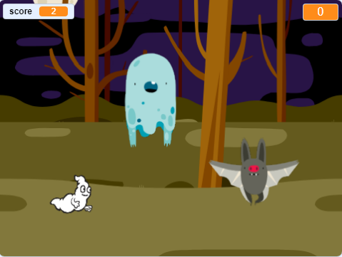

## சவால்: அதிக sprites

உங்கள் விளையாட்டுக்கு பிற sprite-களை சேர்க்க முடியுமா?

நீங்கள் சேர்க்க விரும்பும் ஒவ்வொரு sprite-களுக்கும் சில விஷயங்களைப் பற்றி சிந்திக்க வேண்டும்:

+ Sprite எவ்வளவு பெரியதாக இருக்க வேண்டும்?
+ இது பேய் sprite-ஐ விட அடிக்கடி தோன்ற வேண்டுமா அல்லது குறைவாக தோன்ற வேண்டுமா?
+ பிடிபடும்போது அது பார்ப்பதற்கு எப்படி இருக்க வேண்டும் / எவ்வாறு ஒலிக்க வேண்டும்?
+ Sprite -ஐப் பிடித்தால், விளையாடுபவர் எத்தனை புள்ளிகளை வெல்வார் (அல்லது இழப்பார்)?

உங்களுக்கு உதவி தேவைப்பட்டால், முந்தைய படிகளில் உள்ள வழிமுறைகளுக்கு நீங்கள் திரும்பிச் சென்று பார்க்கலாம் அல்லது நண்பரிடம் கேட்கலாம்!