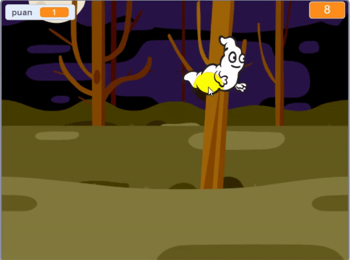

\--- no-print \---

Bu, projenin **Scratch 3** sürümüdür. Projenin aynı zamanda [Scratch 2 sürümü](https://projects.raspberrypi.org/en/projects/ghostbusters-scratch2) de vardır.

\--- /no-print \---

## Giriş

Bir hayalet yakalama oyunu yapacaksınız!

\--- no-print \---

  <iframe allowtransparency="true" width="485" height="402" src="https://scratch.mit.edu/projects/embed/276874679/?autostart=false" frameborder="0" scrolling="no"></iframe>
  

\--- /no-print \---

\--- print-only \---

\--- /print-only \---

## \--- collapse \---

## title: Nelere ihtiyacınız var

### Donanım

- Bir bilgisayar

### Yazılım

- Scratch 3 'ü hem ([çevrimiçi](http://rpf.io/scratchon){:target="_blank"} hem de [çevrimdışı](http://rpf.io/scratchoff){:target="_blank"}) kullanabilirsiniz

\--- /collapse \---

## \--- collapse \---

## title: Neler öğreneceksiniz

- Döngüler içindeki eylemler arasındaki duraklama gereksinimini anlayın
- Scratch'te rastgele sayılar üretmek için bu kodu kullanın
- Scratch'e oyun puanı saklamak için bir değişken ekleyin

\--- /collapse \---

## \--- collapse \---

## title: Eğitimciler için ek notlar

\--- no-print \---

Bu projeyi yazdırmanız gerekiyorsa lütfen [yazıcı-dostu sürümü](https://projects.raspberrypi.org/en/projects/ghostbusters/print){:target="_blank"} kullanın.

\--- /no-print \---

Tamamlanmış projeye [buradan](http://rpf.io/p/en/ghostbusters-get){:target="_blank"} ulaşabilirsiniz.

\--- /collapse \---