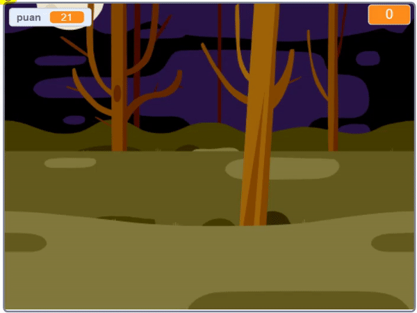

## Giriş

Bir hayalet avlama oyunu yapacaksınız!

### Yapacağınız

\--- no-print \---

\--- /no-print \---

\--- print-only \---

\--- /print-only \---

\--- collapse \---

* * *

## İhtiyacınız olacak şeyler

### Donanım

+ Bir bilgisayar

### Yazılım

+ Scratch 2.0 ([çevrimiçi](http://rpf.io/scratchon){:target="_blank"} ya da [çevrimdışı](http://rpf.io/scratchoff){:target="_blank"})

\--- /collapse \---

\--- collapse \---

* * *

## Öğrenecekleriniz

Bu proje, [ Raspberry Pi Dijital Yapım Müfredatı'nın aşağıdaki bölümlerinden öğeleri kapsamaktadır. ](http://rpf.io/curriculum) {: Hedef = "_ blank"}:

+ [Basit programlar oluşturmak için temel programlama yapılarını kullanın.](https://www.raspberrypi.org/curriculum/programming/creator)

\--- /collapse \---

\--- no-print \---

Eğer bu projeyi yazdırmak istiyorsanız, lütfen [Yazıcı uyumlu sürümü](https://projects.raspberrypi.org/en/projects/ghostbusters/print) kullanın.

\--- /no-print \---