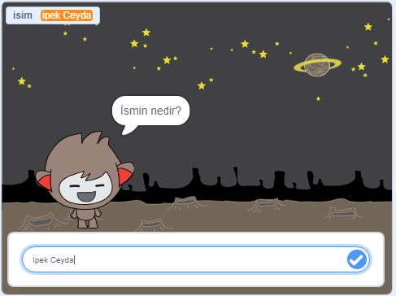

## Sırada ne var?

Hayalet Avcıları projesini tamamladığınız için tebrikler! Biraz daha zor bir şey denemek ister misiniz?

Bir de [Sohbetçi](https://projects.raspberrypi.org/en/projects/chatbot?utm_source=pathway&utm_medium=whatnext&utm_campaign=projects) projesini deneyin.

\--- no-print \---

Yeşil bayrağa tıklayın ve ardından bir konuşma başlatmak için sohbetçinin üstüne tıklayın. Sohbetçi bir soru sorduğunda, cevabınızı Sahne Alanı'nın altındaki kutuya yazın ve ardından sohbetçinin yanıtını görmek için sağdaki mavi işarete tıklayın (veya `Enter` tuşuna basın).

  <iframe allowtransparency="true" width="485" height="402" src="https://scratch.mit.edu/projects/embed/248864190/?autostart=false" 
  frameborder="0" scrolling="no"></iframe>

\--- /no-print \---

\--- print-only \---

\--- /print-only \---