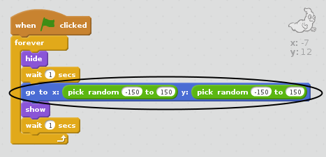

## Rastgele hayaletler

Hayaletiniz şu anda kolayca yakalanabilir, çünkü hareket etmiyor!

\--- task \---

Hayaletinize, aynı yerde kalmak yerine, ekranda rastgele yerlerde gösterecek kodu ekleyebilir misiniz?

\--- hints \--- \--- hint \--- Hayaletinizin her seferinde görünmeden önce sahnede rastgele bir pozisyona `gitmesini` istiyorsunuz. \--- /hint \--- \--- hint \--- Burada kullanabileceğiniz iki kod bloku var. Bu:  Ya da bu:  \--- /hint \--- \--- hint \--- Kodunuz ya böyle:  Ya da böyle görünmeli:  \--- /hint \--- \--- /hints \---

\--- /görev \---

\--- challenge \---

## Zorlama: Daha fazla rastgelelik

Hayaletiniz görünmeden önce rastgele bir süre `beklemesini`{:class=”blockcontrol”} sağlayabilir misiniz? Hayaletinizi her göründüğünde rastgele bir boyuta getirmek için ` set size`{:class=”blocklooks”} bloğunu kullanabilir misiniz? \--- /challenge \---