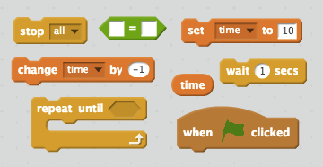
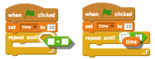

## Zamanlayıcı eklemek

\--- task \---

'Time' adlı bir değişken oluşturun.

\--- /task \---

\--- task \---

Oyuncunun mümkün olduğu kadar hayaleti yakalaması için yalnızca 10 saniye veren zamanlayıcıyı sahneye ekleyebilir misiniz?

Zamanlayıcınız şunları yapmalı:

+ 10 saniyede başlamalı
+ Her saniye 1 azalmalı

Zamanlayıcı 0 olduğunda oyun durmalı.

\--- hints \--- \--- hint \--- `Yeşil bayrak tıklandığı zaman`{:class=”blockevents”}, `zaman`{:class=”blockdata”} değişkeniniz `0 olarak` atanmalı{:class=”blockdata”}. Her saniye `0'a ulaşana kadar`{:class=”blockcontrol"} `-1 ile değiştirilmeli`:class=”blockdata”}. \--- /hint \--- \--- hint \--- Kullanmanız gereken kod blokları burada:  \--- /hint \--- \--- hint \--- Zamanlayıcıyı oyununuza böyle eklemelisiniz: 

Ve bu şekilde `zaman = 0` kod bloku oluşturabilirsin:  \--- /hint \--- \--- /hints \---

\--- /task \---

\--- task \---

Bir arkadaşından oyununu oynamasını iste. Kaç puan alabilir?

\--- /task \---

Eğer oyunun çok kolaysa, bunları yapabilirsin:

+ Oyuncuya daha az zaman ver
+ Hayaleti da seyrek görünür yap
+ Hayaleti daha küçük yap

\--- task \---

Oyununun zorluğunu beğenene kadar birkaç kez oyunu değiştir ve oyna.

\--- /task \---