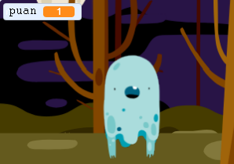

## Bir puan ekle

Şimdi puanınızı kaydederek oyununuzu daha ilginç hale getireceksiniz!

\--- task \---

`puan` adlı yeni bir değişken oluşturun.

[[[generic-scratch3-add-variable]]]

\--- /task \---

\--- task \---

Oyuncunuzun puanını takip edebiliyor musunuz? Oyuncular, yakalamak için hayaletlere tıkladıklarında puan kazanmalıdır.

Oyuncu hayalete her tıkladığında, puanları artmalı.



\--- hints \--- \--- hint \---

`Yeşil bayrak tıklandığında`{:class="block3events"}, `puan`{:class="block3variables"} değişkeninizin `0 'a ayarlanması`{:class="block3variables"} gerekir. Sahne Alanı bu kodu eklemek için en uygun yer.

`Hayalet kuklası tıklandığında`{:class="block3events"} `puan`{:class="block3variables"} değişkeni `1 ile değişmeli`{:class="block3variables"}.

\--- /hint \--- \--- hint \---

İhtiyacınız olan kod blokları:


```blocks3
[puan] i (0) yap

yeşil bayrak tıklandığında
```


```blocks3
[puan] i (1) kadar değiştir
```

\--- /hint \--- \--- hint \---


```blocks3
yeşil bayrak tıklandığında
[puan] i (0) yap
```


```blocks3
Bu kukla tıklandığında
gizle

[puan] i (1) kadar değiştir
```

\--- /hint \--- \--- /hints \---

\--- /task \---