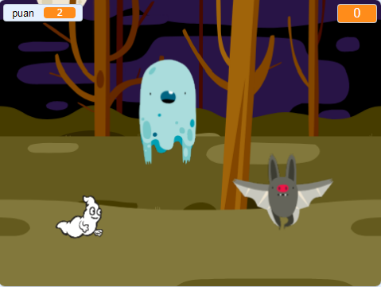

## Challenge

Improve your project with these challenges!

\--- task \---

Eğer oyunun çok kolaysa, bunları yapabilirsin:

+ Oyuncuya daha az zaman ver
+ Hayaletleri daha seyrek görünür yap
+ Hayaletleri daha küçük yap

\--- /task \---

\--- task \---

Oyuna başka kuklalar ekleyebilir misin?

\--- collapse \---

* * *

title: Extra Sprites

* * *

Eklemek istediğiniz her kukla için şunları düşünmeniz gerekir:

+ Kukla ne kadar büyük olmalı?
+ Hayalet kuklasından daha az mı yoksa daha çok mu görünmeli?
+ Yakalandığında nasıl görünüp / ses çıkarmalı?
+ Kuklayı yakaladığında oyuncu kaç puan kazanır (veya kaybeder)?

Yardıma ihtiyacınız olursa, önceki adımlardaki talimatlara geri dönebilir veya bir arkadaşınıza sorabilirsiniz!

\--- /collapse \---

\--- /task \---

\--- task \---

Can you add code to your ghost sprite to make the ghost `wait`{:class="block3control"} a random amount of time while it is hidden?

\--- /task \---

\--- task \---

Can you use the `set size`{:class="block3looks"} block to make your ghost a randomly larger or smaller each time it appears?

\--- /task \---

\--- task \---

Can you add code to your ghost so that the ghost makes a sound when it's caught?

\--- /task \---