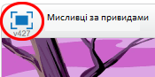

## Вступ

Ви зробите гру, де потрібно ловити привидів!

  <iframe allowtransparency="true" width="485" height="402" src="https://scratch.mit.edu/projects/embed/60787262/?autostart=false" frameborder="0"></iframe>
  

Якщо вам потрібно роздрукувати цей проект, будь ласка скористайтеся [ версією для друку ](https://projects.raspberrypi.org/en/projects/ghostbusters/print).

## \--- collapse \---

## title: Нотатки керівника

## Introduction:

У цьому проекті діти навчаться використовувати змінні для зберігання даних у своїх програмах.

## Ресурси

Для цього проекту використовуйте Scratch 2. Можна користуватись Scratch 2 онлайн на [jumpto.cc/scratch-on](http://jumpto.cc/scratch-on)або завантажити на[jumpto.cc/scratch-off](http://jumpto.cc/scratch-off) і використовувати офлайн.

Повну версію цього проекту ви можете знайти [онлайн](http://scratch.mit.edu/projects/60787262/#editor), або завантажитиза посиланням "Матеріали проекту", яке містить:

* Ghostbusters.sb2

## Цілі навчання

* Variables;
* Випадкові числа.

Цей проект охоплює елементи з наступними стандартами [Raspberry Pi Digital Making Curriculum](http://rpf.io/curriculum):

* [Use basic programming constructs to create simple programs.](https://www.raspberrypi.org/curriculum/programming/creator)

## Завдання

* "Більше випадковості" - використання випадкових чисел;
* "Додавання звуку" - об'єднання вивчення звуків;
* "Більше об'єктів" - застосування умінь для створення ще одного об'єкта гри.

## Найбільш поширенні питання

* Якщо дітям важко натиснути на привидів, не перетягуючи їх навколо, вони можуть грати в гру в повноекранному режимі, в якому привиди не перетягуються.

\--- /collapse \---

## \--- collapse \---

## title: Матеріали проекту

## Ресурси лідера клубу

* [Повний проект Scratch 2 для завантаження](resources/Ghostbusters.sb2)
* [Виконаний онлайн проект Scratch 2](http://scratch.mit.edu/projects/60787262/#editor)\--- /collapse \---