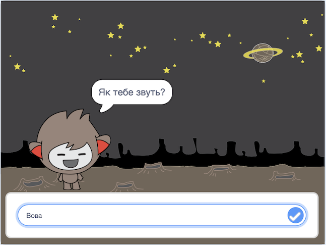

## Що далі?

Молодець, проєкт «Мисливці за привидами» завершено! Хочеш спробувати створити щось трохи складніше?

Спробуй проєкт [Чат-бот](https://projects.raspberrypi.org/en/projects/chatbot?utm_source=pathway&utm_medium=whatnext&utm_campaign=projects).

\--- no-print \---

Натисни на зелений прапорець, а потім на персонажа чат-бота, щоб розпочати розмову. Коли чат-бот ставить запитання, введи свою відповідь у поле в нижній частині Сцени та натисни на синю позначку праворуч (або клавішу `Enter`), щоб побачити його відповідь.

  <iframe allowtransparency="true" width="485" height="402" src="https://scratch.mit.edu/projects/embed/248864190/?autostart=false" 
  frameborder="0" scrolling="no"></iframe>

\--- /no-print \---

\--- print-only \---

\--- /print-only \---