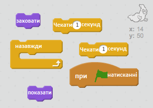
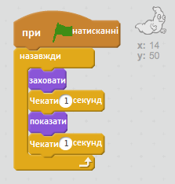

## Анімація привида

\--- task \---

Відкрийте новий порожній проект Scratch.

[[[generic-scratch-new-project]]]

\--- /task \---

\--- task \---

Додайте нового привида і фон сцени.

[[[generic-scratch-sprite-from-library]]]

[[[generic-scratch-backdrop-from-library]]]

\--- /task \---

\--- task \---

Додайте код, щоб привид з'являвся і зникав назавжди при натисканні на прапор.

\--- hints \--- \--- hint \--- Коли ви `настиснули зелений прапорець`, вам потрібно змусити вашого привида `зникнути`на `одну секунду`, а потім знову `з'явитись` на `одну секунду`. It will need to do this `forever`. \--- /hint \--- \--- hint \--- Here are the code blocks you'll need:  \--- /hint \--- \--- hint \--- This is what your code should look like:  \--- /hint \--- \--- /hints \---

\--- /task \---

\--- task \---

Test and save your project.

[[[generic-scratch-saving]]]

\--- /task \---