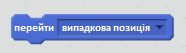
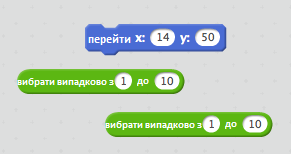
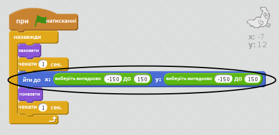

## Випадкові привиди

Вашого привида зараз легко зловити, оскільки він не рухається!

\--- task \---

Чи можете ви додати до вашого привида код, щоб він не залишався в тій же позиції, а з'являвся у випадкових позиціях на екрані?

\--- hints \--- \--- hint \--- You want your ghost to `go to` a random position on the stage before appearing each time. \--- /hint \--- \--- hint \--- There are two sets of code blocks you can use. This one:  Or this one:  \--- /hint \--- \--- hint \--- Your code should look either like this:  Or it can look like this:  \--- /hint \--- \--- /hints \---

\--- /task \---

\--- challenge \---

## Challenge: more randomness

Can you make your ghost `wait` a random amount of time before appearing? Can you use the `set size` block to make your ghost a random size each time it appears? \--- /challenge \---