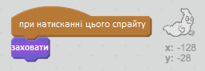

## Ловимо привидів

Давайте дозволимо гравцеві ловити привидів!

\--- task \---

Чи можете ваш привид зникнути після того, як ви його зловили?

Ви маєте натискати на привидів, щоб зловити їх. Якщо вам важко, можете грати гру у повноекранному режимі, натиснувши цю кнопку:

\--- hints \--- \--- hint \--- `При натисканні`, ваш привид повинен `заховатись`. \--- /hint \--- \--- hint \--- Ваш код має виглядати так:  \--- /hint \--- \--- /hints \---

\--- /task \---

\--- challenge \---

## Challenge: додавання звуку

Чи можете ви зробити так, щоб ваш привид видавав звук, коли його спіймано? \--- /challenge \---