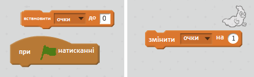
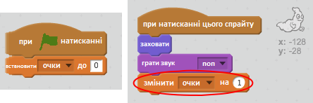

## Додати очки

Давайте зробимо гру цікавішою, зберігаючи очки!

\--- task \---

Створіть нову змінну з назвою "очки".

[[[generic-scratch-add-variable]]]

\--- /task \---

\--- task \---

Зможеш відстежити очки гравців? Гравці набирають очки натискаючи на привидів щоб зловити їх.

Щоразу, коли гравець натискає на привида, рахунок повинен рости.

\--- hints \--- \--- hint \--- `Коли натискається зелений прапорець`, ваша змінна `рахунку` має бути `встановлена на 0`. Сцена - найкраще місце, щоб додати цей код. `When the ghost sprite is clicked`, the `score` should be `changed by 1`. \--- /hint \--- \--- hint \--- Here are the code blocks you will need to use:  \--- /hint \--- \--- hint \--- Here's how to score points by clicking ghosts:  \--- /hint \--- \--- /hints \---

\--- /task \---