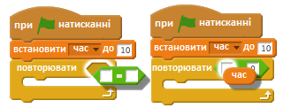

## Додати таймер

\--- task \---

Створіть нову змінну з назвою "час".

\--- /task \---

\--- task \---

Зможете додати таймер на вашу Сцену, щоб дати гравцю лише 10 секунд, щоб зловити якомога більше привидів?

Ваш таймер має:

+ Починатись з 10 секунд
+ Відраховувати кожну секунду

Гра має зупинитись коли таймер дойде до 0.

\--- hints \--- \--- hint \--- `Коли натискається зелений прапорець`, ваша змінна `час` має бути `встановлена на 10`. Потім вона має `змінюватись на -1` щосекунди `поки не сягне 0`. \--- /hint \--- \--- hint \--- Ось кодові блоки, які вам знадобляться:  \--- /hint \--- \--- hint \--- Ось так можна додати таймер в гру: 

А так створити блок `час =0`:  \--- /hint \--- \--- /hints \---

\--- /task \---

\--- task \---

Попросіть друга перевірити гру. Скільки очок він зможе набрати?

\--- /task \---

Якщо гра занадто проста, ви можете:

+ Дайте гравцю менше часу
+ Зробіть, щоб привиди з'являлися рідше
+ Зменшіть привидів

\--- task \---

Змінюйте і випробовуйте свою гру кілька разів, поки не задоволені рівнем складності.

\--- /task \---