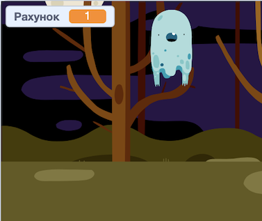

## Додай рахунок

А зараз ти зробиш свою гру ще цікавішою, ведучи рахунок!

\--- task \---

Створи нову змінну з назвою `рахунок`{:class="block3variables"}.

[[[generic-scratch3-add-variable]]]

\--- /task \---

\--- task \---

Чи зможеш ти вести рахунок гравця? Гравці повинні отримувати очки кожного разу, коли ловлять привида.

Щоразу, коли гравець клікає по привиду, кількість очок гравця повинна зростати.



\--- hints \--- \--- hint \---

`Коли зелений прапор натиснуто`{:class="block3events"}, твоя змінна `рахунок`{:class="block3variables"} повинна бути `встановлена в 0`{:class="block3variables"}. Сцена — найкраще місце, щоб додати цей код.

`Коли спрайт привида натиснуто`{:class="block3events"}, змінна `рахунок`{:class="block3variables"} повинна бути `змінена на 1`{:class="block3variables"}.

\--- /hint \--- \--- hint \---

Тобі будуть потрібні наступні блоки коду:


```blocks3
set [score v] to (0)

when flag clicked
```


```blocks3
change [score v] by (1)
```

\--- /hint \--- \--- hint \---


```blocks3
when flag clicked
set [score v] to (0)
```


```blocks3
When this sprite clicked
hide

+ change [score v] by (1)
```

\--- /hint \--- \--- /hints \---

\--- /task \---