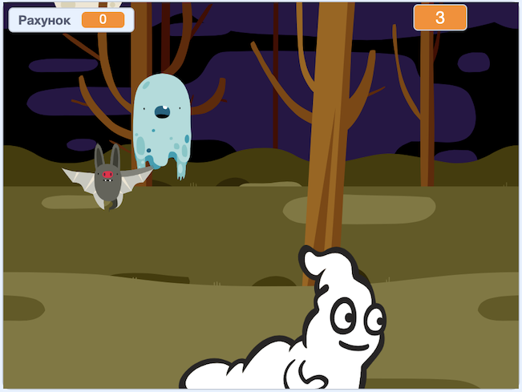

## Challenge

Improve your project with these challenges!

\--- task \---

Якщо гра занадто проста, ти можеш:

+ Дати гравцю менше часу
+ Зробити, щоб привиди з’являлися рідше
+ Зменшити розмір привидів

\--- /task \---

\--- task \---

Чи можеш ти додати інші спрайти до своєї гри?

\--- collapse \---

* * *

title: Extra Sprites

* * *

Для кожного спрайту, якого ти додаєш, подумай про такі речі:

+ Наскільки великим він бає бути?
+ Чи повинен він з'являтися більш або менш часто, ніж спрайт привида?
+ Як він виглядає чи звучить, коли його ловлять?
+ Скільки очок гравець набирає (або втрачає), коли його ловить?

Якщо тобі потрібна допомога, ти можеш перейти до інструкцій з попередніх розділів або попросити друга!

\--- /collapse \---

\--- /task \---

\--- task \---

Can you add code to your ghost sprite to make the ghost `wait`{:class="block3control"} a random amount of time while it is hidden?

\--- /task \---

\--- task \---

Can you use the `set size`{:class="block3looks"} block to make your ghost a randomly larger or smaller each time it appears?

\--- /task \---

\--- task \---

Can you add code to your ghost so that the ghost makes a sound when it's caught?

\--- /task \---