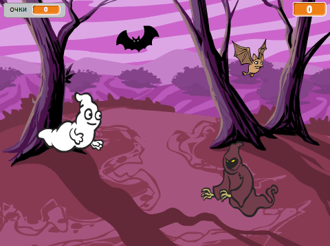

## Завдання: більше спрайтів

Чи можеш ти додати інші спрайти до своєї гри?

Для кожного спрайту, якого ти додаєш, подумай про такі речі:

+ Наскільки великим він бає бути?
+ Чи повинен він з'являтися більш або менш часто, ніж спрайт привида?
+ Як він виглядає чи звучить, коли його ловлять?
+ Скільки очок гравець набирає (або втрачає), коли його ловить?

Якщо тобі потрібна допомога, ти можеш перейти до інструкцій з попередніх розділів або попросити друга!