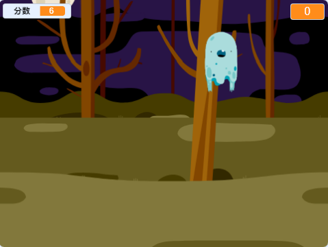

\--- no-print \---

这个项目是基于**Scratch 3**版本的，另外还有一个基于[Scratch 2的版本](https://projects.raspberrypi.org/en/projects/ghostbusters-scratch2)。

\--- /no-print \---

## 简介

你将开发一款捉鬼游戏！

\--- no-print \---

  <iframe allowtransparency="true" width="485" height="402" src="https://scratch.mit.edu/projects/embed/276874679/?autostart=false" frameborder="0" scrolling="no"></iframe>
  

\--- /no-print \---

\--- print-only \---

\--- /print-only \---

\--- collapse \---

* * *

## title: 你需要准备什么

### 硬件

- 一台计算机

### 软件

- Scratch 3（[在线版本](http://rpf.io/scratchon){:target="_blank"}或[离线版本](http://rpf.io/scratchoff){:target="_blank"}）

\--- /collapse \---

\--- collapse \---

* * *

## title: 你将学到什么

- Understand the need for pauses between actions within loops
- Use code to generate random numbers in Scratch
- Add a variable to store a game score in Scratch

\--- /collapse \---

## \--- collapse \---

## title: 教师附加说明

\--- no-print \---

如果您需要打印此项目，请使用[适合打印的版本](https://projects.raspberrypi.org/en/projects/ghostbusters/print){:target="_blank"}.

\--- /no-print \---

You can find the [completed project here](http://rpf.io/p/en/ghostbusters-get){:target="_blank"}.

\--- /collapse \---