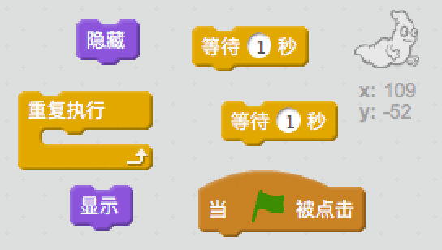
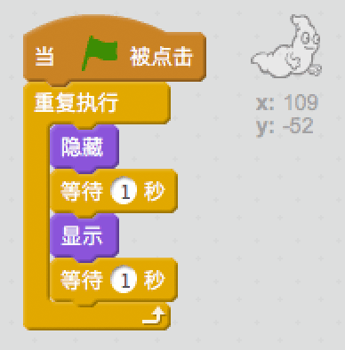

## 幽灵动画

\--- task \---

打开一个空白Scrach工程。

[[[generic-scratch-new-project]]]

\--- /task \---

\--- task \---

添加一个幽灵角色并选择一个合适的舞台背景。

[[[generic-scratch-sprite-from-library]]]

[[[generic-scratch-backdrop-from-library]]]

\--- /task \---

\--- task \---

为幽灵添加代码，当点击旗子时让它不停地忽隐忽现。

\--- hints \--- \--- hint \--- 一旦`绿旗被点击`，你需要让幽灵`隐藏``1秒钟`然后`显示``1秒钟`。 `永远不停地`重复这个动作。 \--- /hint \--- \--- hint \--- 这是你需要用到的代码块：  \--- /hint \--- \--- hint \--- 你的代码应该如下图这样：  \--- /hint \--- \--- /hints \---

\--- /task \---

\--- task \---

Test and save your project.

[[[generic-scratch-saving]]]

\--- /task \---