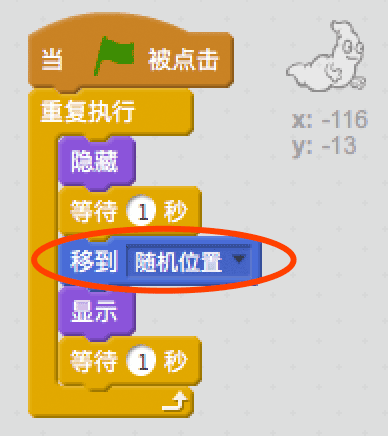
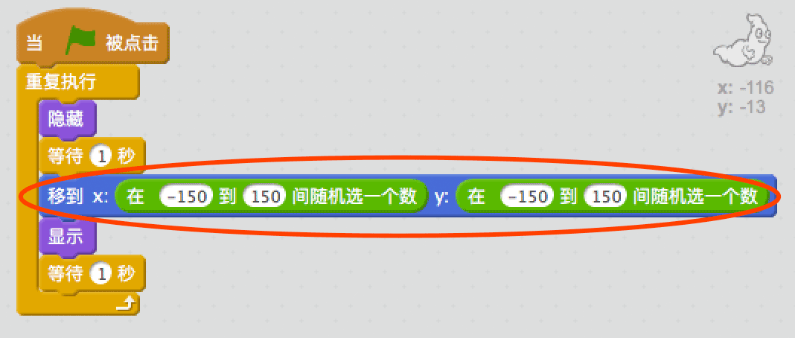

## 随机幽灵

眼下你的幽灵实在是太容易抓捕了，因为它不会动！

\--- task \---

你能为幽灵添加代码让它不再待在一个地方不动，而是在屏幕上随机出现吗？

\--- hints \--- \--- hint \--- 你让幽灵在每次显现出来前`去到`舞台某一随机位置。 \--- /hint \--- \--- hint \--- 你需要用到2组代码块。 这组：  或这组：  \--- /hint \--- \--- hint \--- 你的代码应该如下图：  或者也可以像这样：  \--- /hint \--- \--- /hints \---

\--- /task \---

\--- challenge \---

## 挑战：更多随机性

你能让幽灵`等待`随机时间再显现吗？ 你能用`将角色的大小设定为`代码块让幽灵每次出现时大小随机变化吗？ \--- /challenge \---