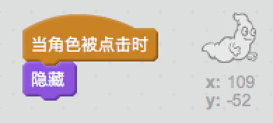

## 捉鬼

让我们的玩家可以捕捉幽灵！

\--- task \---

你能让幽灵被捉到后消失吗？

你应该可以点击幽灵来捕捉它们。如果你觉得很难捕捉，可以点击这个按钮进入全屏模式来进行游戏：

\--- hints \--- \--- hint \--- 当幽灵角色`被点击时`，应该`隐藏`。 \--- /hint \--- \--- hint \--- Your code should look like this:  \--- /hint \--- \--- /hints \---

\--- /task \---

\--- challenge \---

## Challenge: adding a sound

Can you get your ghost to make a sound each time it's caught? \--- /challenge \---