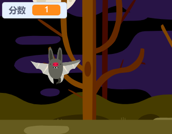

## 添加分数

让我们记录得分让游戏变得更加有趣！

\--- task \---

新建一个名叫“分数”的变量。

[[[generic-scratch-add-variable]]]

\--- /task \---

\--- task \---

你能跟踪玩家的分数吗？当玩家点击幽灵捉住它们可获得积分。

玩家每次点到幽灵分数都会增加。

\--- hints \--- \--- hint \--- `当点击绿旗时`，`分数`变量应该`设为0`。 这段代码最适合添加到舞台上。 `当幽灵角色被点击时`，`分数`应该`增加1`。 \--- /hint \--- \--- hint \--- 这是你需要用到的代码块：  \--- /hint \--- \--- hint \--- 这是当幽灵被点击时如何增加积分：  \--- /hint \--- \--- /hints \---

\--- /task \---