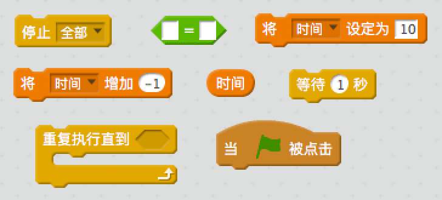
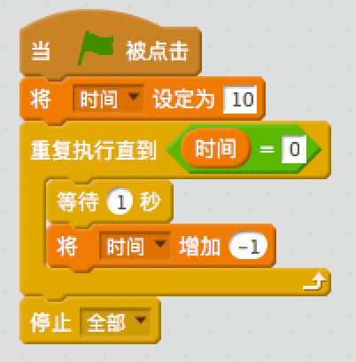
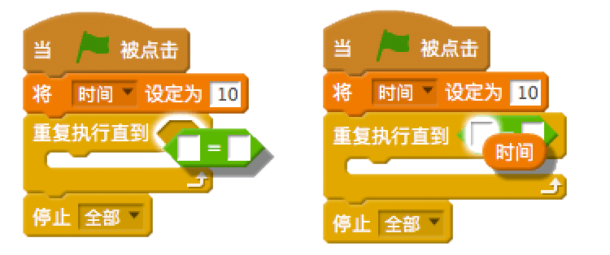

## 添加计时器

\--- task \---

新建一个叫“时间”的变量。

\--- /task \---

\--- task \---

你能为舞台添加一个计数器，只给玩家10秒钟去捕捉尽可能多的幽灵吗？

计时器应当：

+ 初始设置10秒
+ 按秒倒计时

当计时器为0时游戏结束。

\--- hints \--- \--- hint \--- `当点击绿旗时`，`时间`变量应当`设置为10`。 然后每过1秒`变化-1``直到变为0`。 \--- /hint \---\--- hint \--- 这是你需要用到的代码块：  \--- /hint \--- \--- hint \--- 这是如何向游戏中添加计时器： 

这是如何创建`将时间变量设置为0`的代码块：  \--- /hint \--- \--- /hints \---

\--- /task \---

\--- task \---

邀请一位朋友来测试你的游戏。看看他们能得多少分？

\--- /task \---

如果你的游戏太简单，你可以：

+ 给玩家更少的时间
+ 加少幽灵的出现频率
+ 让幽灵变小点

\--- task \---

反复修改并测试你的游戏，直到你觉得难度适中为止。

\--- /task \---