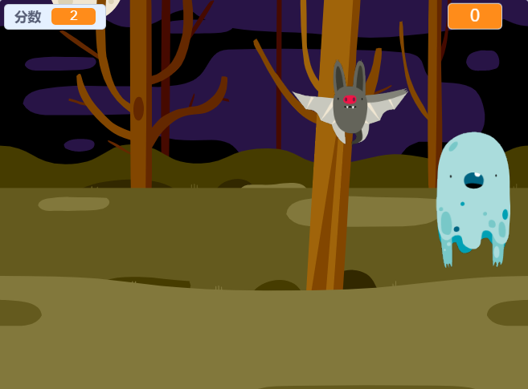

## Challenge

Improve your project with these challenges!

\--- task \---

If your game is too easy, you can:

+ 给玩家更少的时间
+ 减少幽灵的出现频率
+ 让幽灵变小点

\--- /task \---

\--- task \---

你能在你的游戏里添加更多的角色吗？

\--- collapse \---

* * *

title: Extra Sprites

* * *

对于每个添加的角色，你要考虑以下事项：

+ 角色的大小应该是多少？
+ 它应该比幽灵出现的频率更高或更低？
+ 当它被捉到时，应该看上去或听上去如何？
+ 当玩家捉到它时应该得到（或者失去）多少分？

如果你需要帮助，你可以返回查看之前步骤中的说明，或者请教你的朋友！

\--- /collapse \---

\--- /task \---

\--- task \---

Can you add code to your ghost sprite to make the ghost `wait`{:class="block3control"} a random amount of time while it is hidden?

\--- /task \---

\--- task \---

Can you use the `set size`{:class="block3looks"} block to make your ghost a randomly larger or smaller each time it appears?

\--- /task \---

\--- task \---

Can you add code to your ghost so that the ghost makes a sound when it's caught?

\--- /task \---