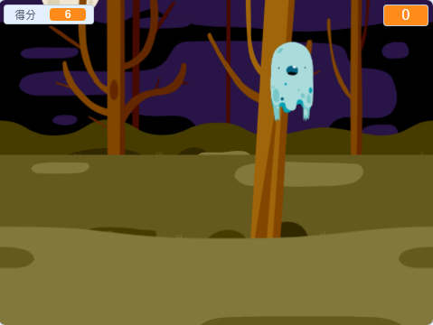

## 介紹

You are going to make a ghost-catching game!

\--- no-print \---

  <iframe allowtransparency="true" width="485" height="402" src="https://scratch.mit.edu/projects/embed/276874679/?autostart=false" frameborder="0" scrolling="no"></iframe>
  

\--- /no-print \---

\--- print-only \---

\--- /print-only \---

## \--- collapse \---

## title: 你會用到

### 硬體

- 一台電腦

### 軟體

- Scratch 3 (either [online](https://rpf.io/scratchon){:target="_blank"} or [offline](https://rpf.io/scratchoff){:target="_blank"})

\--- /collapse \---

## \--- collapse \---

## title: 你會學到

- 了解迴圈（loop）內兩個動作之間必須暫停一下
- 用 Scratch 程式產生隨機（random）的數字
- 用 Scratch 程式添加一個變數（variable）來儲存遊戲得分

\--- /collapse \---

## \--- collapse \---

## title: 給教師的其它資訊

\--- no-print \---

If you need to print this project, please use the [printer-friendly version](https://projects.raspberrypi.org/en/projects/ghostbusters/print){:target="_blank"}.

\--- /no-print \---

You can find the [completed project here](https://rpf.io/p/en/ghostbusters-get){:target="_blank"}.

\--- /collapse \---