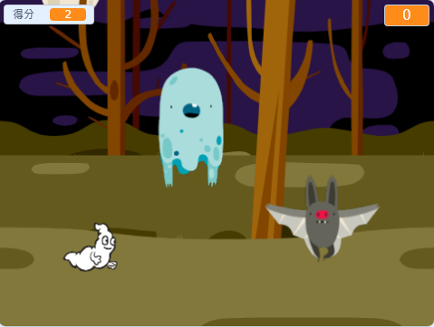

## Challenge

Improve your project with these challenges!

\--- task \---

如果你覺得遊戲太簡單了，你可以：

+ 給玩家更少的時間
+ 讓鬼出現的頻率降低
+ 把鬼變小一點

\--- /task \---

\--- task \---

你可以添加其它的角色到遊戲中嗎？（更多的孤魂野鬼）

\--- collapse \---

* * *

title: Extra Sprites

* * *

在你這麼做前需要考慮一些事：

+ 角色要大一點還是小一點？
+ 它出現的頻率要比幽靈角色多還是少？
+ 它被抓到時會發出什麼聲音或變成什麼樣子？
+ 當玩家抓住它時，會得多少分？還是會扣多少分？

如果你需要幫助，可以返回前面幾個步驟研究，或者向同學請教！

\--- /collapse \---

\--- /task \---

\--- task \---

Can you add code to your ghost sprite to make the ghost `wait`{:class="block3control"} a random amount of time while it is hidden?

\--- /task \---

\--- task \---

Can you use the `set size`{:class="block3looks"} block to make your ghost a randomly larger or smaller each time it appears?

\--- /task \---

\--- task \---

Can you add code to your ghost so that the ghost makes a sound when it's caught?

\--- /task \---